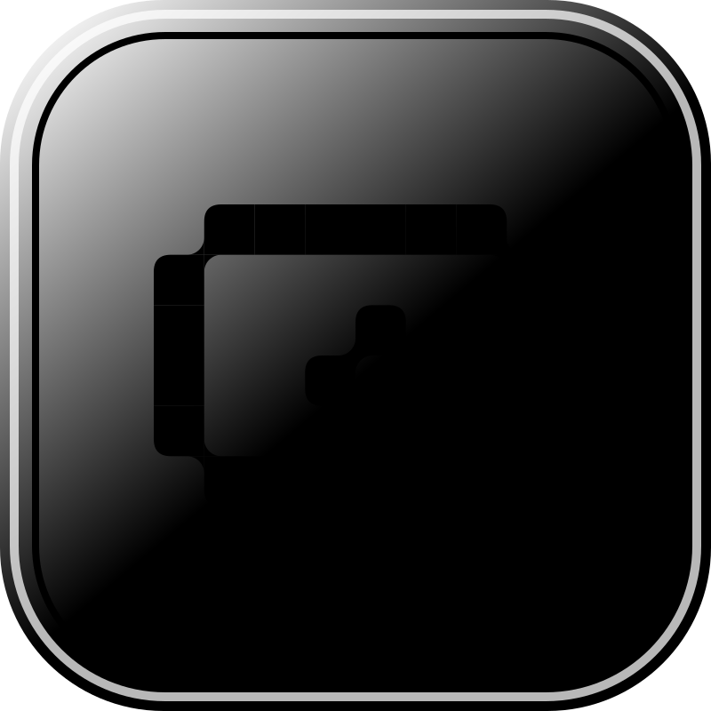
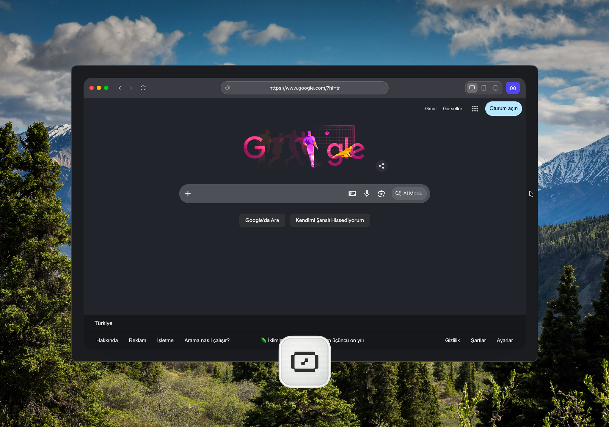
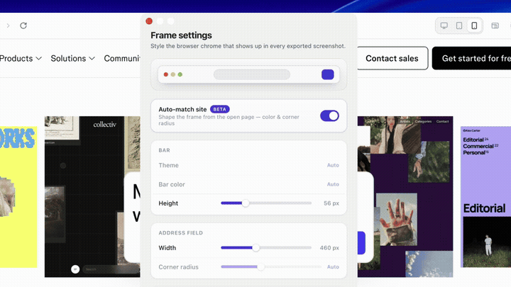
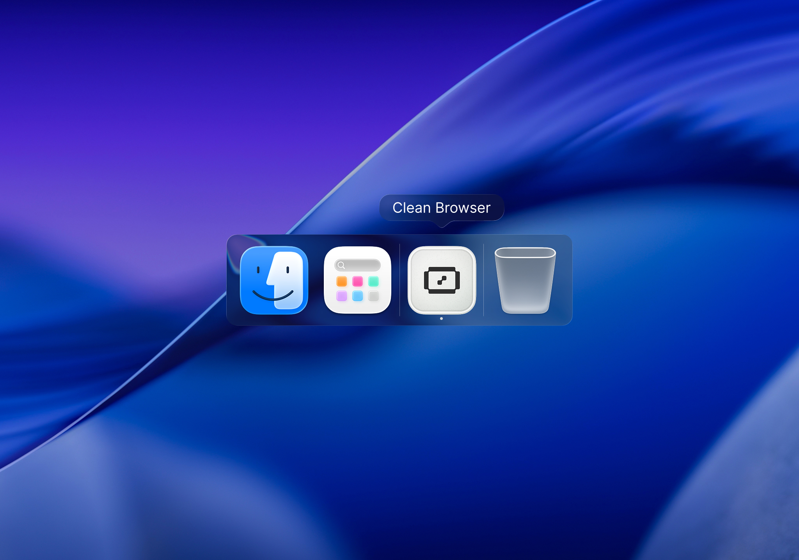

<div align="center">



# Clean Browser

**Frame any website in a polished macOS browser shell and capture a pixel‑perfect screenshot — in one click.**


<br/>



</div>

---

## ✨ Why Clean Browser

Marketing shots, docs, changelogs and social posts look better when the site sits in a clean browser frame on a nice backdrop. Clean Browser is a tiny Chromium browser whose **whole job is producing that shot**: open a URL, style the chrome, pick a backdrop, and export at retina resolution — without a design tool, plugins, or manual cropping.

- 🖼 **The frame is the product.** The styled macOS bar stays in the exported image.
- ⚡️ **One click.** Viewport or full‑page capture, straight to `~/Pictures/Clean Browser` or the clipboard.
- 🎨 **Tunable & repeatable.** Every frame detail is adjustable and savable as a named preset.

---

## 🎬 Demos

<div align="center">


<sub><b>Settings · backdrops · export</b> · <a href="videos/demo-1.mp4">watch full MP4 ↗</a></sub>

<br/><br/>



<sub><b>Browse &amp; frame across viewports</b> · <a href="videos/demo-2.mp4">watch full MP4 ↗</a></sub>

</div>

---

## 🧩 Features

**Frame & chrome**
- Styled macOS browser shell with traffic lights and an address bar that stays in the shot
- Live page rendered in an embedded **Chromium** view inside the frame
- Custom / fake address text (show `yoursite.com` while loading `localhost:3000`)
- Manual **light / dark** chrome theme, or **Auto‑match** — derive the bar color & corner radius from the open page

**Backdrops & canvas**
- Backdrop gallery: solids, mesh gradients, and your own **custom photo** (with an always‑present “+” to add/replace)
- Matte padding, page corner radius, canvas color and soft shadow

**Capture & export**
- **Viewport** screenshot (`⌘⏎`) and **full‑page** scrolling capture (`⌘⇧F`)
- **Copy to clipboard** (`⌘⇧C`) or save to `~/Pictures/Clean Browser`
- Export scale **@1× / @2× / @3×**, format **PNG / JPEG / WebP**, with quality control
- Capture options: hide the toolbar and scrollbars for cleaner edges

**Sizing & presets**
- Viewport presets — **desktop / tablet / phone** — plus aspect‑ratio chips (16:9, 1:1, 9:16, OG) and custom `W × H`
- **Frame presets**: save the current look *and* window size as a named preset, switch between them, delete, or jump back to **Default**
- Session restore: last URL, viewport size and chrome visibility are remembered

**Native settings**
- Tabbed Settings window (**Frame · Canvas · Export**) with macOS vibrancy, light/dark support and a live preview — open with `⌘,`

---

## ⬇️ Install

> **Apple Silicon (arm64) only.** The build is **unsigned** (no paid Apple Developer ID), so macOS needs a one‑time approval. The app is safe — this is just Gatekeeper on unsigned software.

### Homebrew (recommended)

```sh
brew install --cask Grkmyldz148/tap/clean-browser
```

The cask strips the quarantine flag on install, so the unsigned app opens straight away (no “damaged” prompt).

### Download

1. Grab the latest **`clean-browser-<version>-arm64.dmg`** from [**Releases**](https://github.com/Grkmyldz148/clean-browser/releases).
2. Open it and drag **Clean Browser** onto **Applications**.
3. First launch — do **one** of:
   - **Right‑click the app → Open**, then confirm; _or_
   - **System Settings → Privacy & Security → “Open Anyway”**; _or_
   - Terminal:
     ```sh
     xattr -dr com.apple.quarantine "/Applications/Clean Browser.app"
     ```

> Clean Browser is **ad‑hoc signed but not notarized** — notarization (and a warning‑free double‑click install) requires a paid Apple Developer account. Intel Macs need a separate `x64`/universal build.

---

## ⌨️ Keyboard shortcuts

| Action | Shortcut |
| --- | --- |
| Take screenshot | `⌘⏎` |
| Full‑page screenshot | `⌘⇧F` |
| Copy screenshot to clipboard | `⌘⇧C` |
| Open Settings | `⌘,` |
| Reload page | `⌘R` |
| Resize → mobile / tablet / laptop / desktop | `⌘1` · `⌘2` · `⌘3` · `⌘4` |
| Cut · Copy · Paste · Select all · Undo | `⌘X` · `⌘C` · `⌘V` · `⌘A` · `⌘Z` |

---

## 🛠 Development

```sh
npm install
npm run electron:dev
```

Press `⌘,` (or **Clean Browser → Settings…**) to tune the frame live.

---

## 📦 Build

Produce the macOS DMG (custom install layout + app‑icon volume icon):

```sh
npm run electron:build
```

For a local **unsigned** build, skip code‑signing discovery:

```sh
CSC_IDENTITY_AUTO_DISCOVERY=false npm run electron:build
```

Output lands in `release/electron/`. A post‑build hook (`build/set-dmg-icon.cjs`) embeds the app icon into the `.dmg` file so it shows in Finder.

---

## 🗂 Project structure

```
clean-browser/
├─ index.html              # app shell (browser chrome + stage)
├─ src/                    # renderer: navigation, capture, theme, backdrop, settings glue
├─ electron/
│  ├─ main.cjs             # main process: windows, menu, IPC, capture, presets, DMG icon
│  ├─ settings.html        # tabbed Settings window (Frame · Canvas · Export)
│  └─ preload.cjs          # context‑isolated bridges
├─ landing/index.html      # bundled home / start page
├─ src-tauri/icons/        # app icon set (icns / png / ico …)
├─ build/                  # DMG background + icon hook
└─ release/electron/       # packaged .app and .dmg
```

---

## ⚙️ Engine note — Electron vs Tauri

The shipping target is **Electron**, which bundles **Chromium** inside the app — the right choice when the captured browser must be genuinely Chrome/Chromium‑based and render identically everywhere.

A **Tauri** target is kept as an alternate lightweight shell, but Tauri does **not** bundle Chromium (it uses the system WebView: WKWebView on macOS, WebView2 on Windows, WebKitGTK on Linux), so screenshots can differ by platform.

```sh
npm run tauri:dev     # alternate WebView shell
npm run tauri:build
```

---

## 🧭 Roadmap

Planned work (full list in [`ROADMAP.md`](ROADMAP.md)): element/cookie‑banner hiding before capture, page zoom, recent‑URL bookmarks, loading progress bar, annotation & redaction, a capture‑history gallery, and batch capture.

---

<div align="center">
  
  <br/><br/>
  <sub>Built by <b>Görkem YILDIZ</b> · for clean shots.</sub>
</div>
